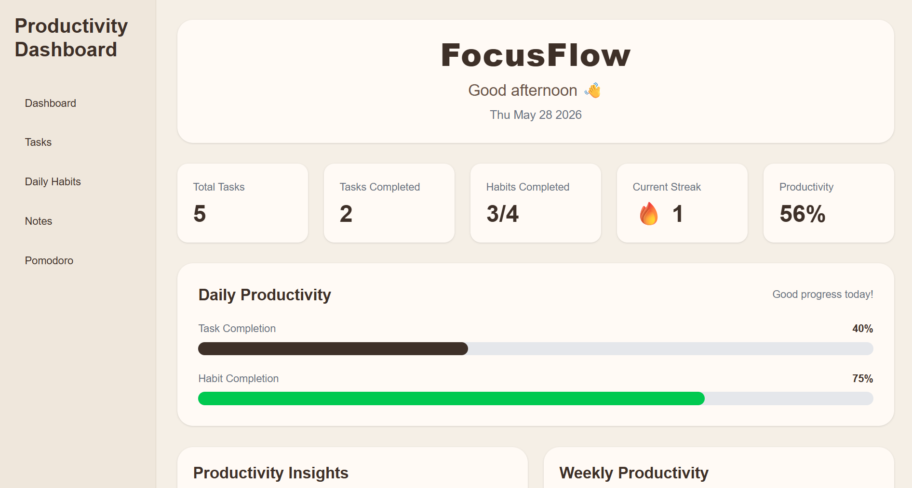
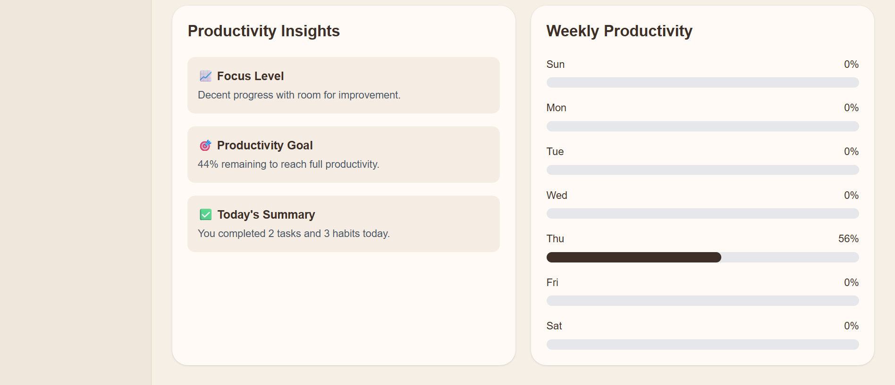
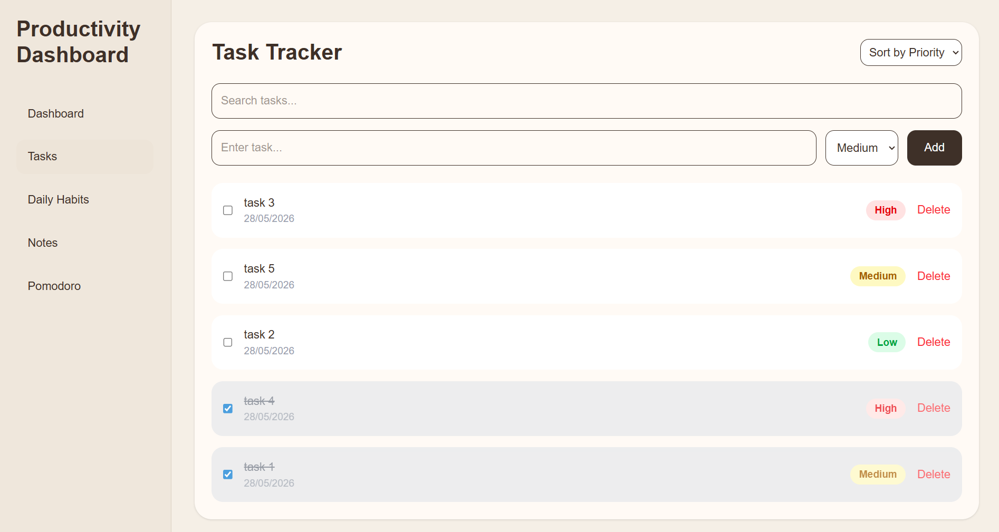
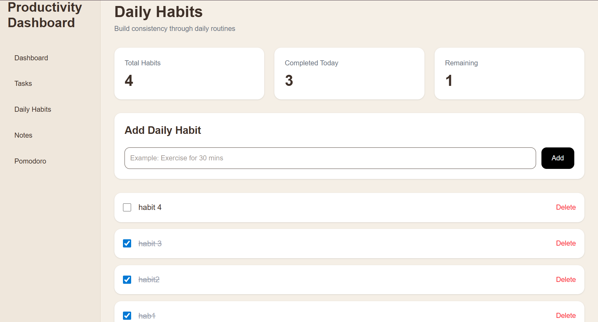
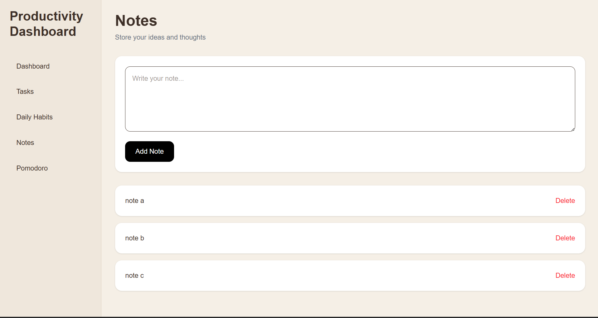
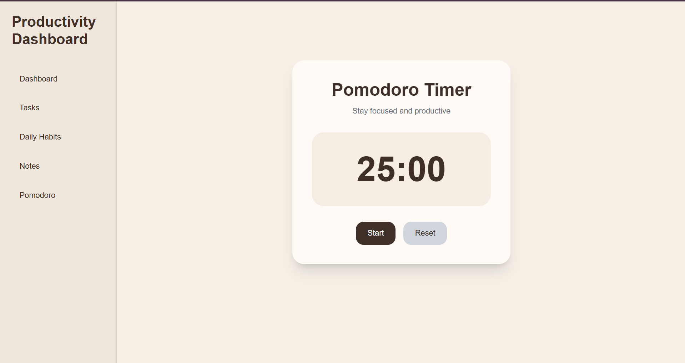

# FocusFlow Productivity Dashboard

A full-stack productivity dashboard built using React, FastAPI, and PostgreSQL to help users manage tasks, habits, notes, and focus sessions efficiently.

---

## Live Demo

### Frontend
[Frontend Live Demo](https://productivity-dashboard-ananya-ps.vercel.app/)

### Backend API
[Backend API](https://productivity-dashboard-ananya-ps.onrender.com)

---

# Features

## Task Management
- Add tasks
- Delete tasks
- Mark tasks as completed
- Sort tasks by:
  - Priority
  - Date added
- Completed tasks automatically move to bottom
- Priority labels:
  - High
  - Medium
  - Low

## Habit Tracking
- Add and track daily habits
- Habit completion analytics
- Habits displayed newest-first

## Notes System
- Create notes
- Delete notes
- Persistent PostgreSQL storage

## Productivity Dashboard
- Overall productivity percentage
- Task completion analytics
- Habit completion analytics
- Weekly productivity tracking
- Daily streak tracking
- Productivity insights section

## Pomodoro Timer
- Start/Pause timer
- Reset timer
- Mobile responsive UI

## Responsive Design
- Fully responsive on:
  - Desktop
  - Tablet
  - Mobile devices

---

# Tech Stack

## Frontend
- React
- React Router
- Tailwind CSS
- Vite

## Backend
- FastAPI
- SQLAlchemy
- Pydantic

## Database
- PostgreSQL

## Deployment
- Vercel (Frontend)
- Render (Backend + PostgreSQL)

---

# Project Structure

```bash
productivity-dashboard-ananya-ps/

├── backend/
│   ├── main.py
│   ├── models.py
│   ├── database.py
│   ├── requirements.txt
│   ├── render.yaml
│   └── Procfile
│
├── frontend/
│   ├── src/
│   │   ├── pages/
│   │   ├── services/
│   │   └── App.jsx
│   │
│   ├── public/
│   ├── package.json
│   └── vercel.json
│
├── screenshots/
│   ├── dashboard1.png
│   ├── dashboard2.png
│   ├── tasks.png
│   ├── habits.png
│   ├── notes.png
│   └── timer.png
│
└── README.md
```

---

# Screenshots

## Dashboard



## Tasks Page


## Habits Page


## Notes Page


## Pomodoro Timer


---

# Local Setup

## 1. Clone Repository

```bash
git clone https://github.com/ananyashetty-bits/productivity-dashboard-ananya-ps.git
```

---

## 2. Backend Setup

```bash
cd backend
pip install -r requirements.txt
uvicorn main:app --reload
```

Backend runs on:
```txt
http://127.0.0.1:8000
```

---

## 3. Frontend Setup

```bash
cd frontend
npm install
npm run dev
```

Frontend runs on:
```txt
http://localhost:5173
```

---

# API Endpoints

## Tasks
- GET /tasks
- POST /tasks
- PUT /tasks/{id}
- DELETE /tasks/{id}

## Notes
- GET /notes
- POST /notes
- DELETE /notes/{id}

---

# Future Improvements

- Dark mode
- User authentication
- Due dates and reminders
- Edit tasks and notes
- Push notifications

---

# Author

Ananya Shetty